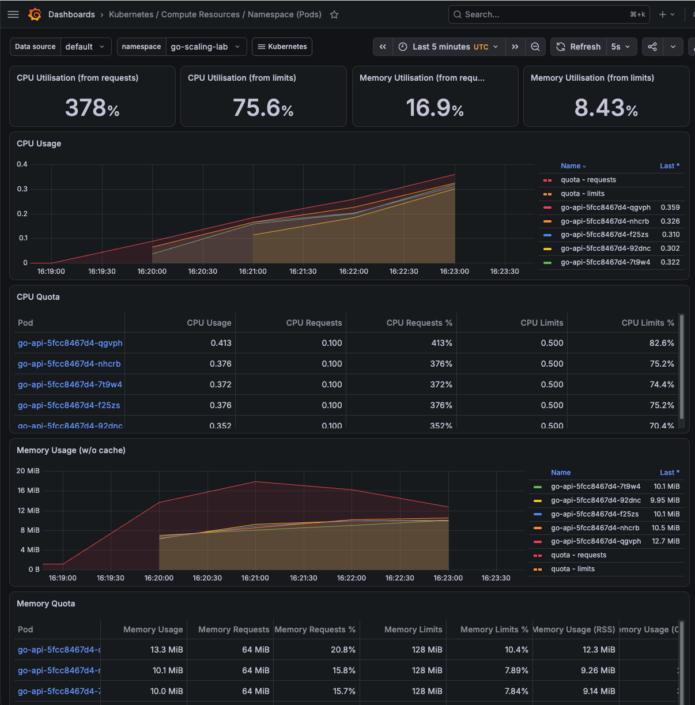

# go-scaling-lab

Go API に k6 で負荷をかけ、Kubernetes HPA によるスケール挙動を Prometheus / Grafana で観測するための学習用リポジトリです。



## このリポジトリでできること

- Go API を Docker image にして kind 上で動かす
- Ingress 経由で API にアクセスする
- k6 で `/cpu` に負荷をかける
- HPA による Pod の増減を確認する
- Prometheus / Grafana で CPU・memory・Pod 数を観測する

## 構成

```text
k6
 ↓
Ingress nginx
 ↓
Service
 ↓
Go API Pods
 ↓
HPA
 ↓
Prometheus / Grafana
```

## 技術スタック

| ツール | 用途 |
| --- | --- |
| Go | API |
| Docker | コンテナ |
| kind | ローカル Kubernetes |
| ingress-nginx | Ingress |
| Kubernetes HPA | オートスケール |
| metrics-server | メトリクス |
| k6 | 負荷テスト |
| Prometheus / Grafana | 監視 |

## 必要なもの

- Go
- Docker
- kind
- kubectl
- Task
- k6
- Helm

## 起動

```bash
task up
```

確認:

```bash
curl localhost/healthz
curl 'localhost/cpu?ms=300'
kubectl get hpa -n go-scaling-lab
```

## 負荷テスト

```bash
task load:k6:smoke
task load:k6:ramping
task load:k6:constant
task load:k6:spike
```

負荷の強さは、`loadtest/` 配下のスクリプトを編集して調整します。

HPA を見る:

```bash
task hpa
```

Pod の CPU を見る:

```bash
kubectl top pods -n go-scaling-lab
```

## 監視

Prometheus / Grafana は必要なときだけ入れます。

```bash
task monitoring:up
```

Grafana:

```text
http://localhost:3000
username: admin
password: task monitoring:password の出力
```

Grafana だけ開き直す:

```bash
task monitoring:grafana
```

Prometheus を直接見る:

```bash
task monitoring:prometheus
```

## 片付け

```bash
task down
```
